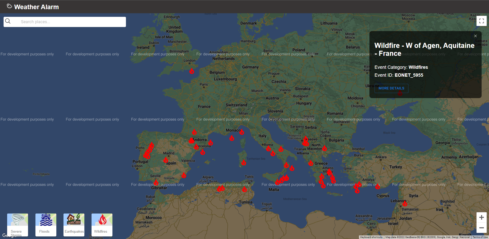

# ReactJS Weather Alarm App

This is a severe weather event tracker that tracks natural events like wildfires, severe storms, volcanoes and earthquakes. 
All the events are placed on a world map so the user can see everywhere where an event is taking place. 
The map is initially placed over Europe but the user can directly jump to any place on the map by manually searching for it in a google-maps-powered search bar. 
The user can also move around the map and adjust zoom levels to discover more places where these events are occurring. 
Each type of event is represented on the map by a different marker icon that the user can click to reveal an information card with details about the event and a button that redirects the user to that particular event's page on the official Earth Observatory Natural Event Tracker(EONET) website. 
Finally the user can filter the types of events that are presented on the map by selecting one or more of the event types that are displayed at the bottom right side of the screen. 
All event data including its coordinates is retrieved from the EONET NASA API that provides a curated source of continuously updated natural event metadata. 

This web app was built with:
* ReactJS
* React Hooks
* Axios
* Material UI
* iconify/react
* react-google-maps/api
* google-map-react
* EONET NASA API

Click <a href="https://adtx.github.io/weather_alarm_reactjs_nasa_api/" target="_blank">here</a> to try out the app for yourself.
